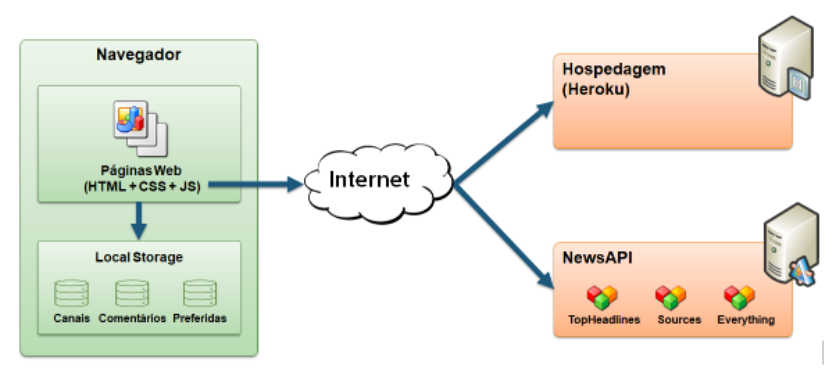

# Informações do Projeto
`TÍTULO DO PROJETO`  

Maus-tratos contra os animais.

`CURSO` 

Ciência da Computação

## Participantes

Caio Batella, Caroline Freitas Alvernaz, Danillo Soares Ferreira, Giulia Mendes Reggiani e Pedro Marcelo Ciríaco Moura

# Estrutura do Documento

- [Informações do Projeto](#informações-do-projeto)
  - [Participantes](#participantes)
- [Estrutura do Documento](#estrutura-do-documento)
- [Introdução](#introdução)
  - [Problema](#problema)
  - [Objetivos](#objetivos)
  - [Justificativa](#justificativa)
  - [Público-Alvo](#público-alvo)
- [Especificações do Projeto](#especificações-do-projeto)
  - [Personas e Mapas de Empatia](#personas-e-mapas-de-empatia)
  - [Histórias de Usuários](#histórias-de-usuários)
  - [Requisitos](#requisitos)
    - [Requisitos Funcionais](#requisitos-funcionais)
    - [Requisitos não Funcionais](#requisitos-não-funcionais)
  - [Restrições](#restrições)
- [Projeto de Interface](#projeto-de-interface)
  - [User Flow](#user-flow)
  - [Wireframes](#wireframes)
- [Metodologia](#metodologia)
  - [Divisão de Papéis](#divisão-de-papéis)
  - [Ferramentas](#ferramentas)
  - [Controle de Versão](#controle-de-versão)
- [**############## SPRINT 1 ACABA AQUI #############**](#-sprint-1-acaba-aqui-)
- [Projeto da Solução](#projeto-da-solução)
  - [Tecnologias Utilizadas](#tecnologias-utilizadas)
  - [Arquitetura da solução](#arquitetura-da-solução)
- [Avaliação da Aplicação](#avaliação-da-aplicação)
  - [Plano de Testes](#plano-de-testes)
  - [Ferramentas de Testes (Opcional)](#ferramentas-de-testes-opcional)
  - [Registros de Testes](#registros-de-testes)
- [Referências](#referências)

# Introdução

## Problema

Atualmente, muitas Organizações Não Governamentais (ONGs) de ajuda aos animais relatam ter dificuldades em encontrar contribuintes e pessoas interessadas em adotar os animais que foram maltratados e deixados na ONG para tratamento, ao mesmo tempo em que ainda mais animais maltratados são deixados e, muitas vezes, passam o resto de suas vidas lá. Com isso, notou-se a necessidade de ajudar as ONGs tanto em uma melhor divulgação de suas atividades, quanto na divulgação de seus pets que estão aptos à adoção. Além disso, viu-se a carência de mostrar, de simular e apresentar ao futuro dono de pets os gastos e cuidados que o animal pode ter.

> **Links Úteis**:
> - [Objetivos, Problema de pesquisa e Justificativa](https://medium.com/@versioparole/objetivos-problema-de-pesquisa-e-justificativa-c98c8233b9c3)
> - [Matriz Certezas, Suposições e Dúvidas](https://medium.com/educa%C3%A7%C3%A3o-fora-da-caixa/matriz-certezas-suposi%C3%A7%C3%B5es-e-d%C3%BAvidas-fa2263633655)
> - [Brainstorming](https://www.euax.com.br/2018/09/brainstorming/)

## Objetivos

O projeto possui como objetivo geral fornecer ajuda às ONGs de animais que, principalmente após a vigência da pandemia do Covid-19, estão perdendo seus patrocinadores.
Como objetivos específicos tem-se: apresentar as necessidades básicas que um animal pode ter; divulgar as ONGs e quais são suas necessidades atuais; construir perfis básicos para apresentar os animais ao interessados em adoção; Mostrar a maneira correta de realizar as denúncias contra maus-tratos.

> **Links Úteis**:
> - [Objetivo geral e objetivo específico: como fazer e quais verbos utilizar](https://blog.mettzer.com/diferenca-entre-objetivo-geral-e-objetivo-especifico/)

## Justificativa

Ao ver a quantidade de crescente de animais abandonados, foi criado um interesse em entrar em contato com as pessoas competentes, como veterinários e ONGs de ajuda aos animais, a fim de coletar maiores informações sobre o problema e buscar saber de que forma podemos contribuir. Ao contatar essas pessoas, foi exposta a necessidade real de divulgar melhor os pets que estão prontos para a adoção, uma vez que as ONGs, majoritariamente, não suportam a quantidade de animais que possuem, nem podem receber ainda mais animais. Além disso, pelo fato de muitas pessoas devolverem os pets com a justificativa de que não têm condições financeiras de manter o animal, deseja-se construir uma simulação de custos básicos que precisarão ser arcados no caso de a pessoa realmente querer seguir com a adoção. Ainda, muitas pessoas possuem dúvidas em relação à forma correta de denunciar maus-tratos, portanto viu-se a oportunidade e a necessidade de explicar a forma correta de o fazer.

> **Links Úteis**:
> - [Como montar a justificativa](https://guiadamonografia.com.br/como-montar-justificativa-do-tcc/)

## Público-Alvo

Os principais indivíduos que serão beneficiados e que também nos ajudarão no decorrer do projeto são os membros de ONGs de ajuda aos animais que possuem dificuldades de encontrar novos patrocinadores e novos donos de pets. Essas pessoas possuem como principal queixa a falta de adoção dos animais, portanto faz-se necessário apoiar a causa. Além dos citados anteriormente, ainda é importante citar que os já donos de animais, a Polícia Civil, Instituto Brasileiro do Meio Ambiente e dos Recursos Naturais Renováveis (IBAMA), influenciadores e outros cidadãos dispostos a ajudar, são peças importantes para a continuidade e crescente do projeto.

> **Links Úteis**:
> - [Público-alvo: o que é, tipos, como definir seu público e exemplos](https://klickpages.com.br/blog/publico-alvo-o-que-e/)
> - [Qual a diferença entre público-alvo e persona?](https://rockcontent.com/blog/diferenca-publico-alvo-e-persona/)
 
# Especificações do Projeto

Deseja-se por meio deste projeto criar aba de ajuda com denúncias contra maus-tratos, facilitar o processo de adoção, fornecer as instruções adequadas àqueles que tem ou que pretendem ter um pet, facilitar o processo de doação para ONGs e sua divulgação, além de mostrar os animais que estão aptos a encontrar um lar definitivo. Deseja-se incluir todas essas informações em uma única ferramenta que seja acessível e simples.

## Personas e Mapas de Empatia

Dentre as personas estudadas, percebeu-se pontos em comum que são a vontade de ajudar mais os animais, um prévio envolvimento com ONGs ou clínicas que realizam alguns procedimentos gratuitos em animais, notou-se uma iniciativa de envolver seus próprios amigos no processo de ajuda aos animais, além de terem uma visão de quais instituições mais precisam de ajuda. Em sua maioria, são mulheres com idade entre 25 e 50 anos que possuem conexão com a natureza.

> 
> 
> **Persona**
> 
> 
> 
> 
> Fonte: [Como criar uma persona para o seu negócio](https://raissaviegas.com.br/como-criar-uma-persona/)

## Histórias de Usuários

Com base na análise das personas foram identificadas as seguintes histórias de usuários:

|EU COMO... `PERSONA`| QUERO/PRECISO ... `FUNCIONALIDADE` |PARA ... `MOTIVO/VALOR`                 |
|--------------------|------------------------------------|----------------------------------------|
|Maria Julia         | um espaço de fácil comunicação com ONGs | começar sua própria ONG           |
|Marcia              | que exista um serviço em que facilite a alocação de animais encontrados na reserva que foram abandonados e precisam ser tratados| expandir sua ONG e atrair mais membros para a equipe |
|Fernanda            | um software para adotar cachorros resgatados e abrir a própria clínica veterinária | ajudar animais resgatados |

> **Links Úteis**:
> - [Histórias de usuários com exemplos e template](https://www.atlassian.com/br/agile/project-management/user-stories)
> - [Como escrever boas histórias de usuário (User Stories)](https://medium.com/vertice/como-escrever-boas-users-stories-hist%C3%B3rias-de-usu%C3%A1rios-b29c75043fac)

## Requisitos

As tabelas que se seguem apresentam os requisitos funcionais e não funcionais que detalham o escopo do projeto.

### Requisitos Funcionais

|ID    | Descrição do Requisito  | Prioridade |
|------|-----------------------------------------|----|
|RF-001| O site deve oferecer um cadastro de usuário | ALTA | 
|RF-002| O site deve conter perfil completo dos cachorros disponíveis para adoção | ALTA |
|RF-003| O site deve mostrar as ONGs parceiras que precisam ser atendidas e que precisam ser ajudadas | ALTA |
|RF-004| O site deve demonstrar a maneira correta de se denunciar maus-tratos | MÉDIA |
|RF-005| O site deve conter informações diversas sobre como cuidar do seu pet | BAIXA |

### Requisitos não Funcionais

|ID     | Descrição do Requisito  |Prioridade |
|-------|-------------------------|----|
|RNF-001| O sistema deve ser responsivo para rodar em um dispositivos móvel | MÉDIA | 
|RNF-002| Deve processar requisições do usuário em no máximo 3s |  BAIXA | 
|RNF-003|O sistema deve funcionar tanto em dispositivos Android, quanto em iOS |  BAIXA | 

> - [Requisitos Funcionais (RF)](https://pt.wikipedia.org/wiki/Requisito_funcional):
>   correspondem a uma funcionalidade que deve estar presente na
>   plataforma (ex: cadastro de usuário).
>
> - [Requisitos Não Funcionais (RNF)](https://pt.wikipedia.org/wiki/Requisito_n%C3%A3o_funcional):
>   correspondem a uma característica técnica, seja de usabilidade,
>   desempenho, confiabilidade, segurança ou outro (ex: suporte a
>   dispositivos iOS e Android).

> **Links Úteis**:
> 
> - [O que são Requisitos Funcionais e Requisitos Não Funcionais?](https://codificar.com.br/requisitos-funcionais-nao-funcionais/)
> - [O que são requisitos funcionais e requisitos não funcionais?](https://analisederequisitos.com.br/requisitos-funcionais-e-requisitos-nao-funcionais-o-que-sao/)

## Restrições

O projeto está restrito pelos itens apresentados na tabela a seguir.

|ID| Restrição                                             |
|--|-------------------------------------------------------|
|RE-01| O sistema não garante a resolução do problema, busca-se apenas minimizá-lo |
|RE-02| O sistema exige conexão com a internet para seu funcionamento        |
|RE-03| O sistema deve se restringir às tecnologias básicas da Web no Frontend | 

> **Links Úteis**:
> - [O que são Requisitos Funcionais e Requisitos Não Funcionais?](https://codificar.com.br/requisitos-funcionais-nao-funcionais/)
> - [O que são requisitos funcionais e requisitos não funcionais?](https://analisederequisitos.com.br/requisitos-funcionais-e-requisitos-nao-funcionais-o-que-sao/)

# Projeto de Interface

O projeto de interface foi elaborado a fim de facilitar a utilização do sistema por parte do cliente principal, que são tanto as ONGs que desejam se cadastrar a fim de adquirir mais recursos, quanto àqueles que desejam ajudar os animais em tratamento, seja com adoção, ou com a doação de recursos. As interfaces de solução foram elaboradas a partir de entrevistas de pessoas do ramo, que tiveram como principal queixa o fato de que poucos animais são adotados, enquanto mutos outros são deixados na ONG e lá permanecem durante toda a vida. As personas estudadas foram apresentadas como pessoas que ou já possuem conhecimento sobre ONGs e já participam de uma, ou querem aprimorar e fazer parte de uma. Após a união de todos esses fatores foi possível construir uma interface que atenda às necessidades dos cientes que são os mais interessados na resolução do problema.

## User Flow

......  INCLUA AQUI O DIAGRAMA COM O FLUXO DO USUÁRIO NA APLICAÇÃO ......

> Fluxo de usuário (User Flow) é uma técnica que permite ao desenvolvedor
> mapear todo fluxo de telas do site ou app. Essa técnica funciona
> para alinhar os caminhos e as possíveis ações que o usuário pode
> fazer junto com os membros de sua equipe.
>
> **Links Úteis**:
> - [User Flow: O Quê É e Como Fazer?](https://medium.com/7bits/fluxo-de-usu%C3%A1rio-user-flow-o-que-%C3%A9-como-fazer-79d965872534)
> - [User Flow vs Site Maps](http://designr.com.br/sitemap-e-user-flow-quais-as-diferencas-e-quando-usar-cada-um/)
> - [Top 25 User Flow Tools & Templates for Smooth](https://www.mockplus.com/blog/post/user-flow-tools)
>
> **Exemplo**:
> 
> 

## Wireframes

https://www.figma.com/file/4kpFmua7PFnK17rxomAxzQ/Maus-tratos-a-c%C3%A3es-framework?node-id=0%3A1

# Metodologia

O presente trabalho tem por objetivo apontar um problema e propor uma forma de solucioná-lo, analisando a visão de pessoas que estão diretamente ligadas ao problema e que desejam solucioná-lo, fazendo necessária a realização de pesquisas qualitativas. A pesquisa qualitativa foi a escolhida, uma vez que possibilita o aprofundamento de ideias por parte do entrevistado, de forma que este fica livre para responder questões abertas da maneira que interpretar mehor, fornecendo uma visão ampla do problema estudado.

## Divisão de Papéis

O trabalho foi desenvolvido através de uma divisão simples de tarefas, sem que haja um hierarquia específica em que os alunos que se sentem mais confortáveis com certas áreas de atuação tomaram a frente para assumir as tarefas de cada "setor". Os alunos Caio e Pedro ficaram responsáveis pela construção dos wireframes, enquanto os demias, Caroline, Danillo e Giulia focaram na parte da documentação do projeto. Anteriormente, cada integrante ficou responsável por estudar as diferentes personas possíveis para o projeto e, também, responsáveis por entrevistar e coletar dados sobre os clientes atraves de pesquisas qualitativas.

## Ferramentas

| Ambiente  | Plataforma              |Link de Acesso |
|-----------|-------------------------|---------------|
|Processo de Design Thinkgin  | Miro | https://miro.com/app/board/uXjVOB18Ug8=/  | 
|Repositório de código | GitHub | https://github.com/ICEI-PUC-Minas-PMGCC-TI/tiaw-pmg-cc-t-20221-g4-maus-tratos-aos-animais |  
|Protótipo Interativo | Figma | https://www.figma.com/file/4kpFmua7PFnK17rxomAxzQ/Maus-tratos-a-c%C3%A3es-framework?node-id=0%3A1 | 

> As ferramentas empregadas no projeto são:
> 
> - Editor de código: Visual Studio Code
> - Ferramentas de comunicação: WhatsApp e Teams
> - Ferramentas de diagramação: Bizagi
> - Plataforma de hospedagem> GitHub
> 
> O editor de código foi escolhido porque ele possui uma integração com o
> sistema de versão. As ferramentas de comunicação utilizadas possuem
> integração semelhante e por isso foram selecionadas. Por fim, para criar
> diagramas utilizamos essa ferramenta por melhor captar as
> necessidades da nossa solução.

## Controle de Versão

......  COLOQUE AQUI O SEU TEXTO ......

> Discuta como a configuração do projeto foi feita na ferramenta de
> versionamento escolhida. Exponha como a gerência de tags, merges,
> commits e branchs é realizada. Discuta como a gerência de issues foi
> realizada.
> A ferramenta de controle de versão adotada no projeto foi o
> [Git](https://git-scm.com/), sendo que o [Github](https://github.com)
> foi utilizado para hospedagem do repositório `upstream`.
> 
> O projeto segue a seguinte convenção para o nome de branchs:
> 
> - `master`: versão estável já testada do software
> - `unstable`: versão já testada do software, porém instável
> - `testing`: versão em testes do software
> - `dev`: versão de desenvolvimento do software
> 
> Quanto à gerência de issues, o projeto adota a seguinte convenção para
> etiquetas:
> 
> - `bugfix`: uma funcionalidade encontra-se com problemas
> - `enhancement`: uma funcionalidade precisa ser melhorada
> - `feature`: uma nova funcionalidade precisa ser introduzida
>
> **Links Úteis**:
> - [Tutorial GitHub](https://guides.github.com/activities/hello-world/)
> - [Git e Github](https://www.youtube.com/playlist?list=PLHz_AreHm4dm7ZULPAmadvNhH6vk9oNZA)
> - [5 Git Workflows & Branching Strategy to deliver better code](https://zepel.io/blog/5-git-workflows-to-improve-development/)
>
> **Exemplo - GitHub Feature Branch Workflow**:
>
> 

# **############## SPRINT 1 ACABA AQUI #############**

# Projeto da Solução

......  COLOQUE AQUI O SEU TEXTO ......

## Tecnologias Utilizadas

......  COLOQUE AQUI O SEU TEXTO ......

> Descreva aqui qual(is) tecnologias você vai usar para resolver o seu
> problema, ou seja, implementar a sua solução. Liste todas as
> tecnologias envolvidas, linguagens a serem utilizadas, serviços web,
> frameworks, bibliotecas, IDEs de desenvolvimento, e ferramentas.
> Apresente também uma figura explicando como as tecnologias estão
> relacionadas ou como uma interação do usuário com o sistema vai ser
> conduzida, por onde ela passa até retornar uma resposta ao usuário.
> 
> Inclua os diagramas de User Flow, esboços criados pelo grupo
> (stoyboards), além dos protótipos de telas (wireframes). Descreva cada
> item textualmente comentando e complementando o que está apresentado
> nas imagens.

## Arquitetura da solução

......  COLOQUE AQUI O SEU TEXTO E O DIAGRAMA DE ARQUITETURA .......

> Inclua um diagrama da solução e descreva os módulos e as tecnologias
> que fazem parte da solução. Discorra sobre o diagrama.
> 
> **Exemplo do diagrama de Arquitetura**:
> 
> 

# Avaliação da Aplicação

......  COLOQUE AQUI O SEU TEXTO ......

> Apresente os cenários de testes utilizados na realização dos testes da
> sua aplicação. Escolha cenários de testes que demonstrem os requisitos
> sendo satisfeitos.

## Plano de Testes

......  COLOQUE AQUI O SEU TEXTO ......

> Enumere quais cenários de testes foram selecionados para teste. Neste
> tópico o grupo deve detalhar quais funcionalidades avaliadas, o grupo
> de usuários que foi escolhido para participar do teste e as
> ferramentas utilizadas.
> 
> **Links Úteis**:
> - [IBM - Criação e Geração de Planos de Teste](https://www.ibm.com/developerworks/br/local/rational/criacao_geracao_planos_testes_software/index.html)
> - [Práticas e Técnicas de Testes Ágeis](http://assiste.serpro.gov.br/serproagil/Apresenta/slides.pdf)
> -  [Teste de Software: Conceitos e tipos de testes](https://blog.onedaytesting.com.br/teste-de-software/)

## Ferramentas de Testes (Opcional)

......  COLOQUE AQUI O SEU TEXTO ......

> Comente sobre as ferramentas de testes utilizadas.
> 
> **Links Úteis**:
> - [Ferramentas de Test para Java Script](https://geekflare.com/javascript-unit-testing/)
> - [UX Tools](https://uxdesign.cc/ux-user-research-and-user-testing-tools-2d339d379dc7)

## Registros de Testes

......  COLOQUE AQUI O SEU TEXTO ......

> Discorra sobre os resultados do teste. Ressaltando pontos fortes e
> fracos identificados na solução. Comente como o grupo pretende atacar
> esses pontos nas próximas iterações. Apresente as falhas detectadas e
> as melhorias geradas a partir dos resultados obtidos nos testes.

# Referências

......  COLOQUE AQUI O SEU TEXTO ......

> Inclua todas as referências (livros, artigos, sites, etc) utilizados
> no desenvolvimento do trabalho.
> 
> **Links Úteis**:
> - [Formato ABNT](https://www.normastecnicas.com/abnt/trabalhos-academicos/referencias/)
> - [Referências Bibliográficas da ABNT](https://comunidade.rockcontent.com/referencia-bibliografica-abnt/)
